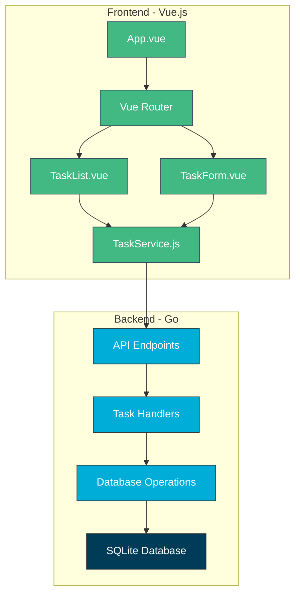
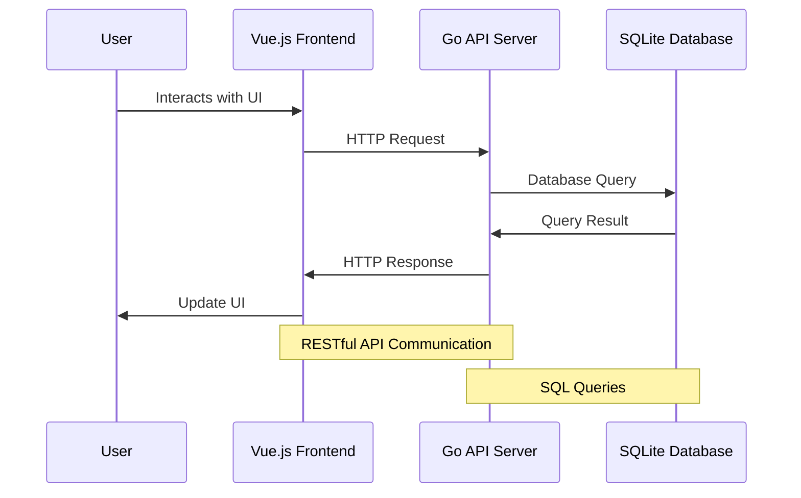

# Detailed Design Document - Task Management CRUD Application

This document describes the detailed design of the Task Management CRUD application, including client-side behavior, server-side behavior, and their relationships.

## Architecture Overview

The application follows a client-server architecture with clear separation of concerns:

1. **Client-side**: Vue.js frontend application that provides the user interface and handles user interactions
2. **Server-side**: Go backend that exposes RESTful API endpoints and handles business logic
3. **Database**: SQLite database for persistent data storage

## Client-Side Behavior

### Components Structure

- **App.vue**: Root component that sets up the application layout and includes the router view
- **Router**: Manages navigation between different views
- **Views**:
  - **TaskList.vue**: Displays the list of tasks with options to edit and delete
  - **TaskForm.vue**: Handles both creation and editing of tasks
- **Services**:
  - **TaskService.js**: Provides methods to interact with the backend API

### Data Flow

1. User interacts with the UI (clicks buttons, fills forms)
2. Vue components call appropriate methods in TaskService
3. TaskService makes HTTP requests to the backend API
4. Components receive responses and update their state
5. Vue's reactive system updates the UI based on state changes

### State Management

- Local component state using Vue's `data()` option
- Props for passing data between parent and child components
- Computed properties for derived state

## Server-Side Behavior

### API Layer

- Uses Gorilla Mux for HTTP routing
- Implements RESTful endpoints for CRUD operations
- Handles request validation and error responses
- Implements CORS to allow cross-origin requests from the frontend

### Business Logic Layer

- Processes incoming requests
- Validates input data
- Calls appropriate database operations
- Formats responses

### Database Layer

- Uses SQLite as the database engine
- Provides functions to interact with the database
- Implements CRUD operations for tasks
- Handles database errors and connection management

## Database Schema

The application uses a simple SQLite database with a single `tasks` table:

```sql
CREATE TABLE IF NOT EXISTS tasks (
    id INTEGER PRIMARY KEY AUTOINCREMENT,
    title TEXT NOT NULL,
    description TEXT,
    status TEXT DEFAULT 'pending'
);
```

## API Endpoints

| Method | Endpoint | Description | Request Body | Response |
|--------|----------|-------------|--------------|----------|
| GET    | /api/tasks | Get all tasks | None | Array of Task objects |
| GET    | /api/tasks/:id | Get a specific task | None | Task object |
| POST   | /api/tasks | Create a new task | Task object (without ID) | Created Task with ID |
| PUT    | /api/tasks/:id | Update a task | Task object | Updated Task |
| DELETE | /api/tasks/:id | Delete a task | None | No content (204) |

## Data Models

### Task Model

```go
type Task struct {
    ID          int    `json:"id"`
    Title       string `json:"title"`
    Description string `json:"description"`
    Status      string `json:"status"`
}
```

## Component Relationships



## Request-Response Flow



## Error Handling

### Frontend Error Handling

- Try-catch blocks around API calls
- Error state in components to display error messages
- User-friendly error messages

### Backend Error Handling

- HTTP status codes for different error types
- Detailed error messages in response bodies
- Logging of errors for debugging

## Security Considerations

- Input validation on both client and server
- CORS configuration to restrict access to the API
- Prepared statements for database queries to prevent SQL injection

## Future Enhancements

1. User authentication and authorization
2. Task categories or tags
3. Task due dates and reminders
4. File attachments for tasks
5. Task assignment to users
6. Activity logging and history
