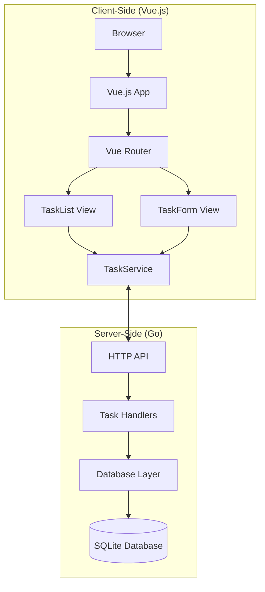
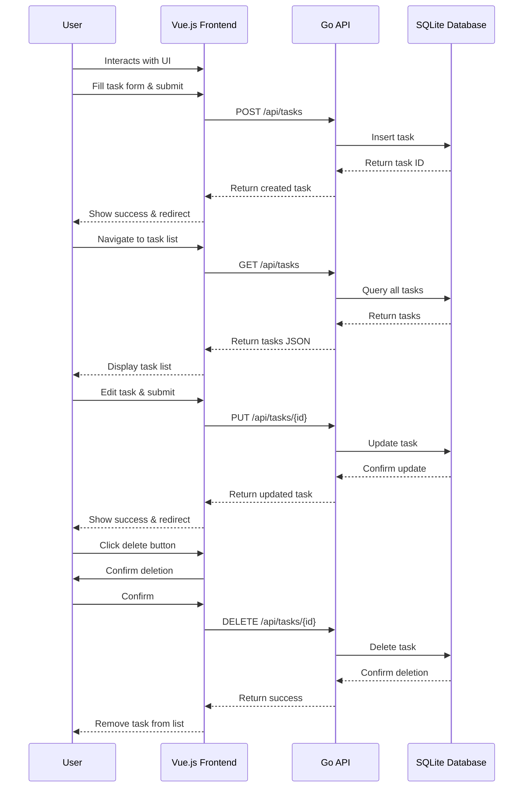

# Detailed Design Document - Task Management CRUD Application

## Overview

This document describes the detailed design of the Task Management CRUD application, including client-side behavior, server-side behavior, and their relationships.

## System Architecture

The application follows a classic client-server architecture with a clear separation between the frontend and backend components:



## Client-Side Behavior

### Components and Views

1. **App.vue**
   - Root component that provides the application layout
   - Contains navigation links and router view

2. **TaskList.vue**
   - Displays a list of all tasks
   - Provides options to edit or delete tasks
   - Handles task filtering and status display
   - Communicates with the backend via TaskService

3. **TaskForm.vue**
   - Handles both creation and editing of tasks
   - Form validation and submission
   - Dynamically changes based on whether creating or editing

### Services

1. **TaskService.js**
   - Provides methods for CRUD operations
   - Uses Axios for HTTP requests to the backend API
   - Methods:
     - `getTasks()`: Fetches all tasks
     - `getTask(id)`: Fetches a specific task
     - `createTask(task)`: Creates a new task
     - `updateTask(task)`: Updates an existing task
     - `deleteTask(id)`: Deletes a task

### Routing

The application uses Vue Router for navigation between views:
- `/`: TaskList view (displays all tasks)
- `/create`: TaskForm view for creating a new task
- `/edit/:id`: TaskForm view for editing an existing task

### Data Flow

1. User interacts with the UI (clicks a button, submits a form)
2. Vue component calls the appropriate TaskService method
3. TaskService sends HTTP request to the backend API
4. Component receives response and updates the UI accordingly

## Server-Side Behavior

### API Layer

The Go backend exposes a RESTful API using the Gorilla Mux router:
- `GET /api/tasks`: Returns all tasks
- `GET /api/tasks/{id}`: Returns a specific task
- `POST /api/tasks`: Creates a new task
- `PUT /api/tasks/{id}`: Updates a task
- `DELETE /api/tasks/{id}`: Deletes a task

### Handler Layer

1. **task_handlers.go**
   - Contains HTTP handlers for each API endpoint
   - Parses requests and validates input
   - Calls appropriate database functions
   - Returns JSON responses

### Database Layer

1. **database.go**
   - Provides functions for database operations
   - Uses Go's standard `database/sql` package with SQLite driver
   - Functions:
     - `InitDB()`: Initializes the database connection and creates tables if needed
     - `GetAllTasks()`: Retrieves all tasks
     - `GetTask(id)`: Retrieves a specific task
     - `CreateTask(task)`: Creates a new task
     - `UpdateTask(task)`: Updates an existing task
     - `DeleteTask(id)`: Deletes a task

### Data Model

The Task model is defined in `models/task.go`:
```go
type Task struct {
    ID          int    `json:"id"`
    Title       string `json:"title"`
    Description string `json:"description"`
    Status      string `json:"status"`
}
```

### Database Schema

The SQLite database has a single `tasks` table:
```sql
CREATE TABLE IF NOT EXISTS tasks (
    id INTEGER PRIMARY KEY AUTOINCREMENT,
    title TEXT NOT NULL,
    description TEXT,
    status TEXT DEFAULT 'pending'
);
```

## Component Relationships



## Cross-Cutting Concerns

### Error Handling

1. **Frontend**
   - Uses try/catch blocks for API calls
   - Displays user-friendly error messages
   - Logs detailed errors to console

2. **Backend**
   - Returns appropriate HTTP status codes
   - Provides error messages in response bodies
   - Logs errors for debugging

### Security

1. **CORS Configuration**
   - Backend configured to accept requests only from the frontend origin
   - Appropriate headers and methods allowed

2. **Input Validation**
   - Frontend validates form inputs before submission
   - Backend validates request data before processing

## Deployment Considerations

1. **Frontend**
   - Build with `yarn build` for production
   - Deploy static files to web server or CDN

2. **Backend**
   - Compile Go application for target platform
   - Configure for production database
   - Set up appropriate logging and monitoring

## Future Enhancements

1. User authentication and authorization
2. Task categories or tags
3. Due dates and reminders
4. File attachments
5. Task comments or activity history
